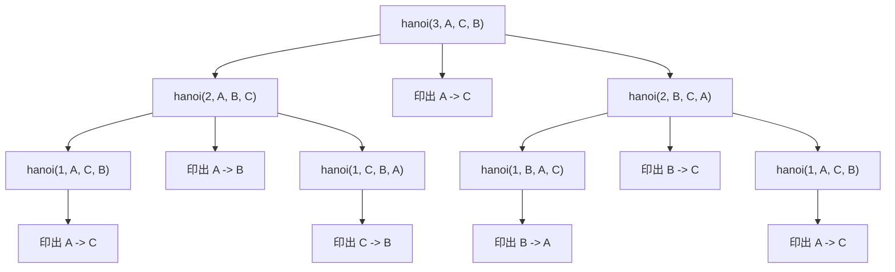

# C++ 河內塔（Tower of Hanoi）呼叫樹圖解版

**語言：** C++  
**主題：** 遞迴（Recursion）、呼叫樹（Call Tree）、分治（Divide and Conquer）  
**日期：** 2026-04-24  
**難度感受：** ⭐⭐⭐⭐  

---

## 這份文件要看什麼？

這份文件的重點不是逐行語法，而是幫你看懂：  
**河內塔的遞迴到底是怎麼一層一層展開的。**

你會看到：

- 原始程式
- `hanoi(3, 'A', 'C', 'B')` 的呼叫樹
- 每個節點代表什麼
- 呼叫順序和實際輸出順序為什麼不同
- 怎麼從呼叫樹看出答案

---

## 原始程式

```cpp
#include <iostream>
using namespace std;

void hanoi(int n, char from, char to, char aux) {
    if (n == 1) {
        cout << from << " -> " << to << endl;
        return;
    }

    hanoi(n - 1, from, aux, to);
    cout << from << " -> " << to << endl;
    hanoi(n - 1, aux, to, from);
}

int main() {
    hanoi(3, 'A', 'C', 'B');
    return 0;
}
```

---

## 先理解函式意思

```cpp
hanoi(n, from, to, aux)
```

表示：

- 要搬 `n` 個圓盤
- 從 `from` 柱開始
- 搬到 `to` 柱
- `aux` 是中途借用的輔助柱

例如：

```cpp
hanoi(3, 'A', 'C', 'B')
```

意思就是：

- 把 3 個圓盤從 A 搬到 C
- B 是輔助柱

---

## 河內塔固定拆法

每次遇到：

```cpp
hanoi(n, from, to, aux)
```

都固定拆成三件事：

1. `hanoi(n - 1, from, aux, to)`
2. 印出 `from -> to`
3. `hanoi(n - 1, aux, to, from)`

口訣：  
**先清路，再搬大，再回收。**

---

## 呼叫樹（Call Tree）圖解

下面這張圖是 `hanoi(3, 'A', 'C', 'B')` 的完整呼叫樹。



---

## 怎麼看這棵樹？

這棵樹的閱讀方式是：

1. 先看最上層 `hanoi(3, A, C, B)`
2. 它會拆成左邊子問題、中間一步、右邊子問題
3. 左右兩個 `hanoi(2, ...)` 又會繼續往下拆
4. 一直拆到 `hanoi(1, ...)` 時停止
5. `hanoi(1, ...)` 就是最小問題，會直接印出一個搬法

也就是說：

- `hanoi(3, ...)` 不會直接印 7 步
- 它會先去處理更小的子問題
- 等子問題完成後，才回來做中間那一步

這就是遞迴最容易卡住的地方：  
**你看到的是函式呼叫，實際輸出卻要等子呼叫做完才會發生。**

---

## 樹狀展開文字版

如果不用圖，`hanoi(3, A, C, B)` 其實可以寫成：

```text
hanoi(3, A, C, B)
├─ hanoi(2, A, B, C)
│  ├─ hanoi(1, A, C, B)  -> 印出 A -> C
│  ├─ 印出 A -> B
│  └─ hanoi(1, C, B, A)  -> 印出 C -> B
├─ 印出 A -> C
└─ hanoi(2, B, C, A)
   ├─ hanoi(1, B, A, C)  -> 印出 B -> A
   ├─ 印出 B -> C
   └─ hanoi(1, A, C, B)  -> 印出 A -> C
```

這個版本很適合直接看出父子關係。

---

## 呼叫順序 vs 輸出順序

這是最重要的一段。

### 呼叫順序

程式一開始的呼叫順序是：

1. `hanoi(3, A, C, B)`
2. `hanoi(2, A, B, C)`
3. `hanoi(1, A, C, B)`

也就是說，它會一路往左邊最深處鑽下去。

### 輸出順序

真正印出來的順序是：

```text
A -> C
A -> B
C -> B
A -> C
B -> A
B -> C
A -> C
```

原因是：

- 遞迴函式會先把左子問題做完
- 回來之後才執行中間那一行 `cout`
- 再去做右子問題

所以輸出順序其實是：  
**左子樹完成 -> 中間輸出 -> 右子樹完成**

這種順序很像二元樹的 **中序走訪（in-order traversal）**。

---

## 一步一步對照

下面把每一步對照到呼叫樹：

| 步驟 | 來自哪個節點 | 輸出 |
|------|-------------|------|
| 1 | `hanoi(1, A, C, B)` | `A -> C` |
| 2 | `hanoi(2, A, B, C)` 的中間步 | `A -> B` |
| 3 | `hanoi(1, C, B, A)` | `C -> B` |
| 4 | `hanoi(3, A, C, B)` 的中間步 | `A -> C` |
| 5 | `hanoi(1, B, A, C)` | `B -> A` |
| 6 | `hanoi(2, B, C, A)` 的中間步 | `B -> C` |
| 7 | `hanoi(1, A, C, B)` | `A -> C` |

---

## 為什麼 `n == 1` 就能停？

因為當只剩 1 個圓盤時，問題已經簡單到不需要再拆。

```cpp
if (n == 1) {
    cout << from << " -> " << to << endl;
    return;
}
```

這就是 **Base Case**。

如果沒有這段，函式會一直呼叫：

- `hanoi(3)` 呼叫 `hanoi(2)`
- `hanoi(2)` 呼叫 `hanoi(1)`
- `hanoi(1)` 又呼叫 `hanoi(0)`
- 然後一路錯下去

所以 Base Case 是遞迴能停下來的關鍵。

---

## 從呼叫樹看出時間複雜度

每一個 `hanoi(n)` 都會再呼叫兩個 `hanoi(n-1)`：

$$
T(n) = 2T(n-1) + 1
$$

所以步數會呈現：

- `n = 1` -> `1`
- `n = 2` -> `3`
- `n = 3` -> `7`
- `n = 4` -> `15`

一般公式：

$$
T(n) = 2^n - 1
$$

因此時間複雜度是 $O(2^n)$。

---

## 學習筆記摘要

## 學習筆記：河內塔呼叫樹

**語言：** C++  
**日期：** 2026-04-24  
**難度感受：** ⭐⭐⭐⭐  

### 這段程式碼做了什麼？

它把搬動 `n` 個圓盤的問題拆成兩個更小的 `n-1` 問題，並在中間插入一次搬最大圓盤的操作。  
透過呼叫樹可以清楚看到遞迴是怎麼一路往下展開，再一層一層回來輸出答案。

### 關鍵概念

| 概念 | 說明 | 記憶口訣 |
|------|------|---------|
| 呼叫樹 | 顯示每個函式如何再呼叫子函式 | 「一層拆一層」 |
| Base Case | `n == 1` 時直接印出搬法 | 「只剩一個就直接搬」 |
| 左子問題 | 先把 `n-1` 個搬到輔助柱 | 「先清路」 |
| 中間步 | 把最大圓盤搬到目標柱 | 「再搬大」 |
| 右子問題 | 把 `n-1` 個搬回目標柱 | 「再回收」 |

### 我還不懂的地方

- [ ] 為什麼呼叫順序和輸出順序不同？
- [ ] 為什麼看起來像二元樹，但中間還有一個 `cout`？
- [ ] 為什麼步數剛好會變成 `2^n - 1`？

### 類似用法

- 階乘的遞迴展開
- 費波那契的呼叫樹
- 合併排序的分治樹

### 我的練習

```cpp
#include <iostream>
using namespace std;

void hanoiTrace(int n, char from, char to, char aux) {
    cout << "進入 hanoi(" << n << ", " << from << ", " << to << ", " << aux << ")" << endl;

    if (n == 1) {
        cout << from << " -> " << to << endl;
        return;
    }

    hanoiTrace(n - 1, from, aux, to);
    cout << from << " -> " << to << endl;
    hanoiTrace(n - 1, aux, to, from);
}

int main() {
    hanoiTrace(3, 'A', 'C', 'B');
    return 0;
}
```

### 總結一句話

> 河內塔的呼叫樹本質上是在告訴你：每個大問題都先拆成左邊小問題，做中間一步，再處理右邊小問題。
